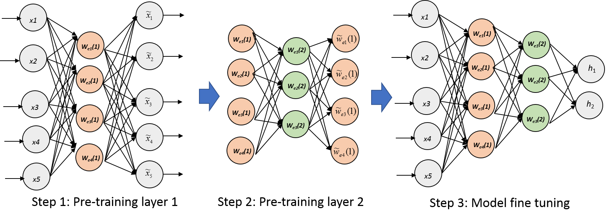

<h3 align="center">Stacking Autoencoders</h3>

  

---

Centrale Lille | [Anas ESSOUNAINI](https://www.linkedin.com/in/anas-essounaini-b7514014a/) | [Contact us][anas-email]

## 📝 Table of Contents

- [📝 Table of Contents](#-table-of-contents)
- [🧐 About ](#-about)
- [🎥 Repository Structure  ](#-repository-structure)
- [🎉 Acknowledgements ](#-acknowledgements)

## 🧐 About 

In this project, we are interested in a popular __Ensemble Learning__ method called __Stacking__. We are going to use this approach to _stack autoencoders_.

An autoencoder is a special type of neural networks whose purpose is to reconstruct the inputs  passing through several intermediate representations (or codes) corresponding to the outputs of the layers. The
objective function minimized by gradient descent during learning by the back-propagation algorithm is the mean square error. If 
is the input reconstructed by the network, the objective function is :  .

Here is the simple structure of the autoencoder that we are going to use :
> Input  code 1  code 2  reconstructed code 1 
 reconstructed input . 

The passage from one layers' representation to the other is parametered with weight matrix  and a bias . 

Our goal is to learn the weight matrices and biases. In order to simplify and lower computational time necessary for training, we are going to use the _tied wheight hypothesis_. In other words, we consider that our auroencoder is symetrical i.e:  .

## 🎥 Repository Structure  

This repository consists of one main directory `src` that contains two files :

1. `main_autoencoder.py`: We coded a 3-layer auto-encoder and train it on the MNIST dataset which contains images of handwritten numbers. The images are in
grayscale and size 28 × 28. This dataset contains 65,000 learning examples divided into 55,000 for
the train and in 10,000 for the test.

1. `main_stacked_autoencoders.py`: We trained the same network as in previous file but layer by layer. Once our weights are determined,
we will add a layer of the softmax regression type to obtain a usual MLP. We then launch
the back-propagation algorithm on this network, some of the weights of which are intelligently initialized.

## 🎉 Acknowledgements 

- Hat tip to anyone whose code was used, especially my Ensemble Learning Professor John Klein

[anas-email]: mailto:essounaini97@gmail.com
